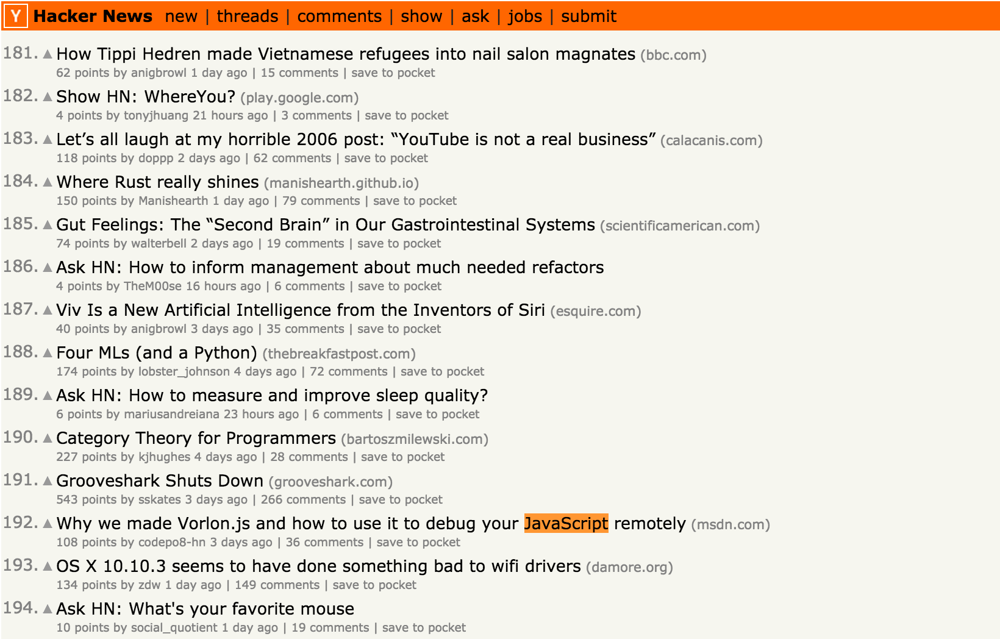

##Recent Projects

  

    

      
      

        <h3><a href="https://github.com/syymza/js-on-hn-emailer">Javascript on Hacker News</a></h3>
        
<a href="https://github.com/syymza/js-on-hn-emailer">Get Notified When Someone Posts An Article From About Javascript on Hacker News Using io.js, Firebase and Email.js</a>

      

    

  

 

##Recent Posts

Here's a list of my latest posts:

<ul class="posts">		
  		
    <li>{{ post.date | date_to_string }} &raquo; <a href="{{ BASE_PATH }}{{ post.url }}">{{ post.title }}</a></li>		
  		
</ul>

